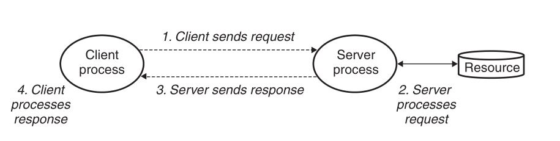
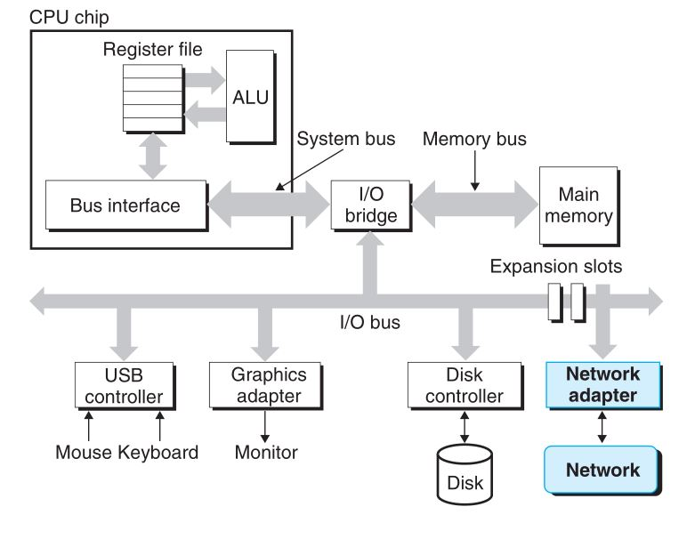
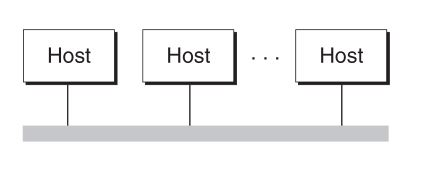
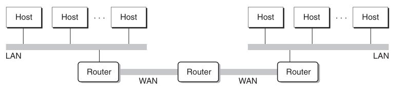
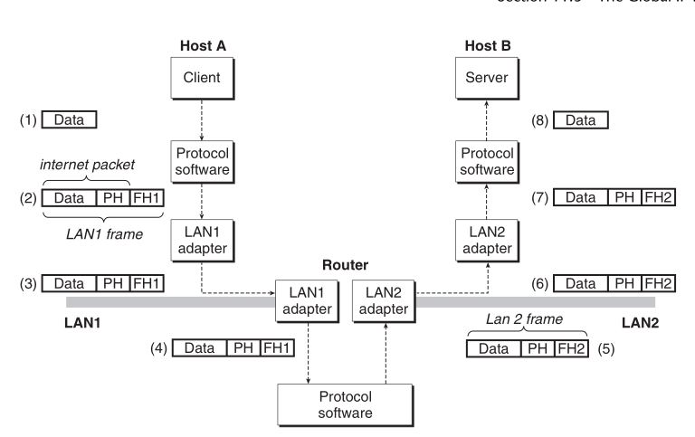

#网络编程
## 客户端-服务器编程模型
  

客户端和服务器是进程 

## 网络
对主机而言, 网络是一种I/O设备.网络适配器提供了到网络的物理接口  
  

以太网段: 包括电缆(双绞线), 和一个叫做集线器的小盒子.电缆一端连接主机的适配器, 一端连接集线器的一个端口上.集线器不加分辨地将从一个端口上收到的每个位复制到其他所有的端口上.  

主机可以发送一段位(称为帧)到这个网段内的其他任何主机. 每个帧包括一些固定数量的头部位(header), 用来标识此帧的源和目的地址以及此帧的长度. 此后紧随的就是数据位的有效载荷.每个主机适配器都能看到这个帧.  

利用网桥和集线器可以连接成较大的局域网  
  

多个不兼容的局域网可以通过路由器连接起来组成互联网络(internet)  

  

运行在每台主机和路由器上的协议软件, 消除了不同网络之间的差异, 这个软件实现一种协议.这种协议必须提供两种基本能力:
1. 命名机制: 互联网络协议定义一种一致的主机地址.唯一标识这台主机
2. 传输机制: 互联网络协议定义一种把数据捆扎成不连续的片(称为包)的同一方式.  

主机A向主机B发送数据: 

  

1. 运行在主机A上的客户端进行系统调用, 从虚拟地址空间复制数据到内核缓冲区.
2. 协议软件在数据前附加互联网包头和LAN1帧头, 创建一个LAN1帧.LAN1帧的有效载荷是互联网包, 而互联网包的有效载荷是实际的用户数据
3. LAN1适配器复制该帧到网络上
4. 当此帧到达路由器时, 路由器的LAN1适配器从电缆上读取它, 并把它送到协议软件
5. 路由器剥落旧的LAN1的帧头, 加上寻址到主机B的新的LAN2帧头, 并把帧传送到适配器
6. 路由器的LAN2适配器复制该帧到网络上
7. 到此帧到达主机B时, 它的适配器从电缆上读到此帧, 并将它传送到协议软件.
8. 协议软件剥落包头和帧头.服务器进行一个读取这些数据的系统调用时, 协议软件将得到的数据复制到服务器的虚拟地址空间中.

#### Internet和internet
internet是一般概念, Internet是具体实现全球IP互联网  

