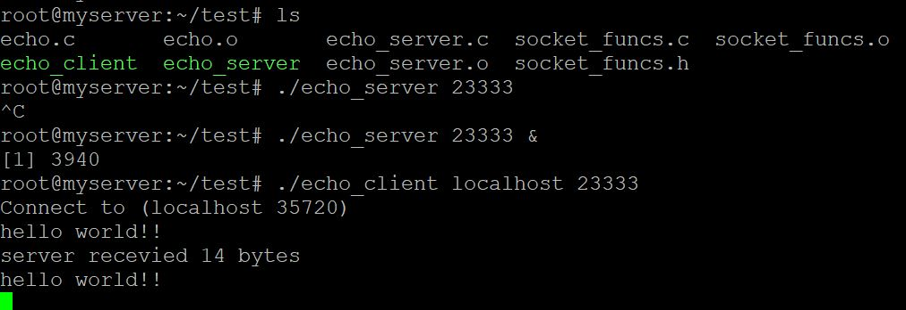

#网络编程
## 客户端-服务器编程模型
  

客户端和服务器是进程 

## 网络
对主机而言, 网络是一种I/O设备.网络适配器提供了到网络的物理接口  
  

以太网段: 包括电缆(双绞线), 和一个叫做集线器的小盒子.电缆一端连接主机的适配器, 一端连接集线器的一个端口上.集线器不加分辨地将从一个端口上收到的每个位复制到其他所有的端口上.  

主机可以发送一段位(称为帧)到这个网段内的其他任何主机. 每个帧包括一些固定数量的头部位(header), 用来标识此帧的源和目的地址以及此帧的长度. 此后紧随的就是数据位的有效载荷.每个主机适配器都能看到这个帧.  

利用网桥和集线器可以连接成较大的局域网  
  

多个不兼容的局域网可以通过路由器连接起来组成互联网络(internet)  

  

运行在每台主机和路由器上的协议软件, 消除了不同网络之间的差异, 这个软件实现一种协议.这种协议必须提供两种基本能力:
1. 命名机制: 互联网络协议定义一种一致的主机地址.唯一标识这台主机
2. 传输机制: 互联网络协议定义一种把数据捆扎成不连续的片(称为包)的同一方式.  

主机A向主机B发送数据: 

  

1. 运行在主机A上的客户端进行系统调用, 从虚拟地址空间复制数据到内核缓冲区.
2. 协议软件在数据前附加互联网包头和LAN1帧头, 创建一个LAN1帧.LAN1帧的有效载荷是互联网包, 而互联网包的有效载荷是实际的用户数据
3. LAN1适配器复制该帧到网络上
4. 当此帧到达路由器时, 路由器的LAN1适配器从电缆上读取它, 并把它送到协议软件
5. 路由器剥落旧的LAN1的帧头, 加上寻址到主机B的新的LAN2帧头, 并把帧传送到适配器
6. 路由器的LAN2适配器复制该帧到网络上
7. 到此帧到达主机B时, 它的适配器从电缆上读到此帧, 并将它传送到协议软件.
8. 协议软件剥落包头和帧头.服务器进行一个读取这些数据的系统调用时, 协议软件将得到的数据复制到服务器的虚拟地址空间中.

#### Internet和internet
internet是一般概念, Internet是具体实现全球IP互联网  

#### IP地址
一个IP地址是一个32位无符号整数(IPv4), IP地址总是以(大端法)网络字节顺序存放.   

#### 因特网域名
  

因特网定义了由域名集合到IP地址集合之间的映射, 由DNS维护.  

#### 因特网连接
客户端和服务器通过在连接上发送和接受字节流来通信, 连接是点对点的.   

一个套接字是连接的一个端点, 每个套接字都有相应的套接字地址, 用"地址:端口"表示.  

客户端套接字地址中的端口是内核自动分配的, 称为临时端口.  

服务器套接字地址中的端口是某个知名端口和这个服务相对应.每个具有知名端口的服务都有一个对应的知名的服务名(Web服务的知名名字是http, email的知名名字是smtp).   

一个连接由两端的套接字地址唯一确定.(cliaddr:cliport, servaddr:servport)  

#### 套接字接口

套接字接口是一组函数, 它们和Unix I/O函数结合起来, 用以创建网络应用.   

#### 套接字地址结构
从Linux内核的角度来看, 一个套接字就是通信的一个端点.从Linux程序的角度来看, 套接字就是一个有相应描述符的打开文件.   

套接字地址结构   
```
// IP 套接字地址结构
struct sockaddr_in {
    uint16_t sin_family;
    uint16_t sin_port;
    struct in_addr sin_addr;
    unsigned char sin_zero[8];
}

// 通用套接字地址结构
struct sockaddr {
    uint16_t sa_family;
    char sa_data[16];
}
```  

#### socket函数
```
#include<sys/types.h>
#include<sys/socket.h>

int socket(int domain, int type, int protocol);

/*
* 创建一个套接字描述符
* AF_INET 表示使用32IP地址
* SOCK_STREAM 表示这个套接字是连接的一个端点.
* 成功返回非负描述符, 出错返回-1
*/
clientfd = socket(AF_INET, SOCK_STREAM, 0);
```  
socket 返回的clientfd描述符仅是部分打开的, 还不能读写.
#### connect函数
```
#include<sys/socket.h>

/*
* addrlen 是sizeof(sockaddr_in)
* 成功返回0, 出错返回-1
*/
int connect(int clientfd, const struct sockaddr *addr, socklent_t addrlen);
```  

connect函数试图与套接字地址为addr的服务器建立一个因特网连接.connect函数会阻塞, 一直到连接成功或者发生错误.如果成功clientfd描述符现在已经可以读写了. 

连接由套接字对刻画:   
(x:y, addr.sin_addr:addr.sin_port)  


服务端函数
***

#### bind函数
```
#include<sys/socket.h>

/*
* 将addr中的服务器套接字地址和套接字sockfd联系起来
* addrlen是sizeof(sockaddr_in)
* 成功返回0, 出错返回-1
*/
int bind(int sockfd, const struct sockaddr *addr, socklen_t addrlen);
```

#### listen函数
```
#incldue<sys/socket.h>

// 成功返回0, 出错返回-1
int listen(int sockfd, int backlog);
```  

socket函数默认创建主动套接字, listen函数将sockfd转化为监听套接字.

#### accept函数
```
#include<sys/socket.h>
/*
* 等待来自客户端的连接请求到达监听描述符listenfd.
* 然后再addr中填写客户端的套接字地址
* 成功返回非负描述符, 出错返回-1
*/
int accept(int listenfd, struct sockaddr *addr, int *addrlen);
```  

监听描述符是作为客服端连接请求的一个端点, 通常创建一次, 存在于服务器整个生命周期.   

连接描述符是客户端和服务器之间已经建立起来的连接的一个端点, 每次接受连接请求都会创建一次, 只存在于服务器为一个客户服务的过程中.   

***  

#### 主机和服务的转换
##### getaddrinfo函数
```
#include<sys/types.h>
#include<sys/socket.h>
#include<netdb.h>

/*
* 给定host和service, 返回result, result指向addrinfo结构的链表.
*/
int getaddrinfo(const char *host, const char *service, const struct addrinfo *hints, struct addrinfo **result);

void freeaddrinfo(struct addrinfo *result);
const char *gai_strerror(int errcode);
```

##### getnameinfo函数
```
#include<sys/socket.h>
#include<netdb.h>

/*
* 将套接字地址结构转换成相应的主机和服务名字符串.
*/
int getnameinfo(const struct sockaddr *sa, socklen_t salen, char *host, size_t hostlen, char *service, size_t servlen, int flags);
```

[show_mapping.c](./show_mapping.c)  

#### 套接字接口辅助函数
[socket_funcs.c](./socket_funcs.c)   

#### echo客户端和服务器实例
[echo_client.c](./echo_client.c)  
[echo_server.c](./echo_server.c) 

运行结果:  
   

## web服务器
[tiny](./tiny.c)


