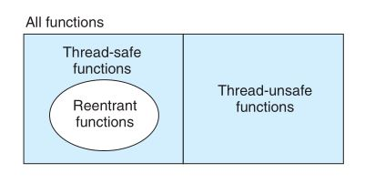

# 并发编程
##基于进程的并发编程
#### 基于进程的并发服务器
构造并发服务器的自然方法是, 在父进程中接受客户端连接请求, 然后创建一个新的子进程来为每个新客户端提供服务.   

子进程关闭它的副本中的监听描述符, 父进程关闭它的连接描述符, 防止内存泄漏.   

  

#### 进程的优劣
进程共享文件表, 但不共享地址空间.   

为了共享信息, 必须使用显示IPC机制.  

## 基于I/O多路复用的并发编程
....

#### 基于I/O多路复用的并发事件驱动服务器
....
#### I/O多路复用技术的优劣
- 优点:
    1. 比基于进程的设计给了程序员更多的对程序行为的控制.
    2. 运行在单一进程的上下文中, 每个逻辑流都能访问该进程的全部地址空间.
    3. 像对顺序程序那样,可以使用调试工具.
- 缺点:
    1. 编码复杂.
    2. 某个逻辑流正忙于读一个文本行, 其他逻辑流就不可能有进展.
    3. 不能充分利用多核处理器.

## 基于线程的并发编程
线程:  线程就是运行在进程上下文中的逻辑流, 线程由内核自动调用, 每个线程都有它自己的线程上下文(包括唯一的整数ID, 栈, 栈指针, 程序计数器...), 所有运行在一个进程里的线程共享这个进程的虚拟地址空间  

#### 线程执行模型
  

每个进程开始生命周期时都是单一线程, 这个线程称为主线程.   

主线程执行一个慢速系统调用(read, sleep, 间隔计数器中断), 控制就会通过上下文切换传递到对等线程, 以此类推.   

线程的上下文切换比进程的上下文切换快.   

主线程和其他线程的区别仅在于它总是进程中第一个运行的线程.   

一个线程可以杀死他的任何对等线程, 或者等待它的任意对等线程终止, 每个对等线程都能读写相同的共享数据.   

#### Posix线程
[hello.c](./hello.c)   

#### 创建线程
....

#### 终止线程
一个线程是以下方式之一来终止:
- 当顶层的线程历程返回时, 线程会隐式地终止.
- 调用pthread_exit
- 某个对等线程调用exit函数, 与该进程相关的线程都终止

#### 回收已终止线程的资源
线程通过调用pthread_join函数等待其他线程终止.


#### 分离线程
线程是可结合的或者分离的.   

可结合的: 可结合的线程能够被其他线程收回和杀死.   

分离的: 一个分离的线程不能被其他线程回收或杀死.   

## 多线程程序中的共享变量
#### 线程内存模型
每个线程都有它自己独立的线程上下文, 包括线程ID, 栈, 栈指针, 程序计数器, 条件码, 通用目的的寄存器值.   

每个线程和其他线程共享整个用户虚拟地址空间.   

线程栈不对其他线程设防.   

#### 将变量映射到内存
多线程C程序中变量根据它们的存储类型被映射到虚拟内存中:  
- 全局变量: 虚拟内存的读/写区域只包含每个全局变量的一个实例, 任何线程都可以引用.
- 本地自动变量: 本地自动变量就是定义在函数内, 但没有static属性的变量, 在运行时, 每个线程的栈都包含它自己的所有本地自动变量的实例(可通过指针访问)
- 本地静态变量: 定义在函数内部, 并且有static属性的变量, 和全局变量一样, 虚拟内存中只包含一个实例., 每个**对等**线程都读写这个实例

#### 共享变量
当且仅当它的一个实例被一个以上的线程引用.   

##用信号量同步线程
#### 信号量
信号量s是具有非负整数值的全局变量, 只能由P和V操作:
- P(s): 如果s是非零的, 将s减一并且立即返回, 如果s为零, 那么就挂起这个线程, 直到s变为非零.
- V(s): 将s加一, 如果有任何线程阻塞在p操作等待s变为非零, 那么v操作会重启这些线程中的一个.

P和V中的测试和减1(加1)操作是不可分割的.   

当有多个线程在等待同一个信号量时, 不能预测V操作要重启哪一个线程.   

```
#include<semaphore.h>
int sem_init(sem_t *sem, 0, unsigned int value);
int sem_wait(sem_t *s); //P(s)
int sem_post(sem_t *s); //V(s)
```   

#### 使用信号量来实现互斥
将共享变量与一个信号量s(初始为1)联系起来, 然后用P(s)和V(s)操作将相应的临界区包围起来.以这种方式来保护共享变量的信号量叫做二元信号量, 一提供互斥为目的的二元信号量也称为互斥锁.. P操作称为对互斥锁加锁, V操作称为对互斥锁解锁.   

#### 利用信号量来调度共享资源
##### 生产者-消费者问题
   

插入和取出项目都涉及更新共享变量, 必须保证对缓冲区的访问是互斥的.   

还需要调度对缓冲区的访问, 如果缓冲区是空的, 那么消费者必须等待直到有一个槽位变为可用. 生产者与之类似.  


##### 读者-写者问题
....

#### 基于预线程化的并发服务器
....

## 使用线程提高并行性
并发程序在多核处理器上运行得更快.   

并行程序的集合是并发程序集合的真子集.   


   

并行编程的同步开销巨大, 要尽可能避免, 如果无法避免, 必须要用尽可能多的有用计算弥补这个开销.   

并行程序常常被写为每个核上只运行一个线程, 一个核上运行多个线程会增加上下文切换开销.   

## 其他并发问题
#### 线程安全
一个函数被称为线程安全的, 当且仅当被多个并发线程反复地调用时, 它会一直产生正确的结果.   

#### 可重入性
可重入函数: 当被多个线程调用时, 不会引用任何共享数据.   

可重入函数是线程安全函数的真子集
   

#### 竞争
当一个程序的正确性依赖于一个线程要在另一个线程到达y点之前到达它的控制流中的x点时, 就会发生竞争.   

```
int main() {
    pthread_t tid[N];
    int i;

    for (i = 0; i < N; ++i) {
        pthread_create(&tid[N], NULL, thread, &i);
    }

    for (i = 0; i < N; ++i) {
        pthread_join(tid[N], NULL);
    }
    exit(0);
}

void *thread(void *vargp) {
    /*
    * myid的值取决于主线程是否已经将i加一
    */
    int myid = *((int *)vargp);
    printf("Hello from thread %d\n", myid);
    return NULL;
}
```  

#### 死锁
一组线程被阻塞了, 等待一个永远也不会为真的条件   

互斥锁加锁顺序规则: 给定所有互斥操作的一个全序, 如果每个线程都是以一种顺序获得互斥锁并以相反的顺序实释放,那么这个程序就是无死锁的.