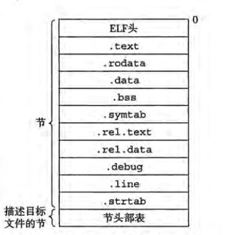
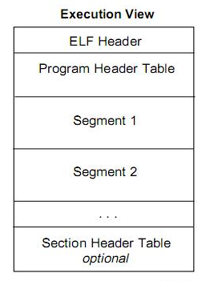
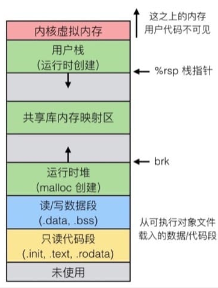

## 编译器驱动程序

大多数编译系统提供编译器驱动程序.   
语言预处理器->编译器->汇编器->链接器.

## 静态链接
静态链接以一组可重定位目标文件和命令行参数作为输入, 生成一个完全链接的, 可以加载和运行的可执行目标文件.

为了构造可执行文件, 链接器必须完成两个主要任务:
1. 符号解析:将目标文件中引用的符号(函数, 全局变量, 静态变量)正好与一个符号的定义关联起来
2. 重定位:把每个符号定义与一个内存位置关联起来, 然后修改所有对这些符号的引用, 使得它们执行这个内存位置.(链接器使用汇编器产生的重定位条目, 不加甄别的执行这样的重定位)

链接器对目标机器了解甚少, 产生目标文件的编译器和汇编器已经完成了大部分工作.

## 目标文件
目标文件有三种形式:
1. 可重定位目标文件
2. 可执行目标文件
3. 共享目标文件:特殊可重定位目标文件, 可在加载或者运行时被动态加载进内存并链接

各个系统的目标文件格式都不相同,但基本概念是相似的.以后的讨论集中在ELF格式上.

## 可重定位目标文件

 

 - ELF头: 描述了生成该文件的系统的字的大小和字节顺序.和帮助链接器语法分析的解释目标文件的信息.
 - 节头部表: 描述了不同节的位置和大小
 - .text: 已编译的机器代码
 - .rodata: 只读数据, 例如printf语句中的格式串和switch语句的跳转表
 - .data: 已初始化的全局和静态C变量(局部变量保存在栈中, 不出现在节里)
 - .bss: 未初始化的全局和静态C变量
 - .symtab: 符号表, 存放在程序中定义的和引用的函数和全局变量的信息.
 - .rel.text: 一个.text节中位置的列表, 当链接器把这个目标文件和其他文件组合时, 需要修改这些位置.
 - .rel.data: 被模块引用或定义的所有全局变量的重定位信息
 - .debug: 调试符号表
 - .line: C源程序中的行号和.text节中机器指令之间的映射
 - .strtab: 字符串表

 ## 符号和符号表

 每个可重定位目标模块m都有一个符号表, 包含m定义和引用的符号的信息.有三种不同的符号:
 - 全局符号:由模块m定义的并能被其他模块引用的全局符号(非静态C的函数和全局变量)
 - 外部符号: 由其他模块定义并被模块m引用的全局符号(在其他模块定义的非静态C函数和全局变量)
 - 局部符号: 只被模块m定义和引用的局部符号(带static属性的C函数和全局变量).这些符号在模块m中任何位置都可见, 但不能被其他模块引用.

 符号表不包含对应于本地非静态程序变量的任何符号(非static局部变量), 这些符号在运行时在栈中被管理.

 #### 用static属性隐藏变量和函数名字

 C程序员用static属性隐藏模块内部的变量和函数声明, 就像在Java和C++中使用public和private声明一样.任何带有static属性的全局变量或函数都是模块私有的.任何不带static属性声明的全局变量和函数都是公共的.

 符号表包含了一个条目的数组.
 ELF符号表条目的结构:
 ```
 typedef struct {
     int name;   
     char type:4,   
          bbinding:4;
     char reserved;
     short section;
     long value;
     long size;
 } Elf64_Symbol;
 ```

## 符号解析
将每个引用与它输入的可重定位目标文件的符号表中的一个确定的符号定义关联起来.   
编译器只允许每个局部符号有一个定义, 静态局部变量也会有本地链接器符号, 并且确保它们拥有唯一的名字.

#### 对C++和Java中链接器符号的重整
编译器将每个唯一的方法和参数列表组合编码成一个对链接器来说唯一的名字.这种编码过程叫做重整.相反的过程叫做恢复  

#### 链接器如何解析多重定义的全局符号

编译时, 编译器向汇编器输出每个全局符号, 或强或弱, 汇编器吧这个信息隐含地编码在可重定位目标文件的符号表里  
函数和已初始化的全局变量是强符号, 未初始化的全局变量是弱符号  
处理规则:
1. 不允许有多个同名的强符号
2. 如果有一个强符号和多个弱符号重名, 选择强符号
3. 如果有多个弱符号同名, 选择任意一个

#### 与静态库链接
静态库: 相关的目标模块打包成为的一个单独的文件.可以作为链接器的输入.当链接器构造一个输出的可执行文件时, 它只复制静态库里被应用程序引用的目标模块.

#### 链接器如何使用静态库来解析引用

一般将库放在命令行的结尾.

## 重定位

链接器在重定位中, 将合并输入模块, 并为每个符号分配运行时地址.重定位由两部组成
1. 重定位节和符号定义: 链接器将所有相同类型的节合并为同一类型的新的聚合节.然后将运行时内存地址赋给新的聚合节->赋给输入模块定义的节->赋给输入模块定义的每个符号.
这一步完成时, 程序中每条指令和全局变量都有唯一的运行时内存地址了.
2. 重定位节中的符号引用: 编译器修改代码节和数据节中对每个符号的引用, 使得它们执行正确的运行时地址.这一步依赖于可重定位目标模块中称为重定位条目的数据结构.

#### 重定位条目
```
typedef struct {
    long offset;
    long type:32,
         symbol:32;
    long addend;
} Elf64_Rela;
```

#### 重定位符号引用
1. ##### 重定位PC相对引用
2. ##### 重定位绝对引用

## 可执行目标文件
   

可执行目标文件的格式类似于可重定位目标文件的格式.
ELF头描述文件的总体格式, 还包括程序的入口点.其他节已经被重定位到了它们最终的运行时内存地址.  
....

## 加载可执行目标文件
加载器将可执行目标文件中的代码和数据从磁盘复制到内存中, 然后通过跳转到程序的第一条指令或入口点来运行程序.  

任何Linux程序都能调用execve函数来调用加载器   

每个Linux程序都有一个运行时内存映像.  


没有展示出由于段对齐要求和地址空间布局随机化造成的空隙,区域大小不成比例.

## 动态链接共享库
静态库的缺点:
1. 如果静态库中某个函数更新, 所有链接了这个函数的程序都要重新链接.
2. 静态库函数的代码会复制到每个运行进程的文本段中, 这是对稀缺内存系统资源的极大浪费.

共享库: 共享库是一个目标模块, 在运行和加载时可以加载到任意的内存地址, 并和一个在内存中的程序链接起来.这个过程称为动态链接.由动态链接器执行.  

共享库以两种方式"共享":
1. 在任何给定的文件系统中, 对于一个库只有一个.so文件.所有引用该库的可执行目标文件共享这个.so文件中的代码和数据.
2. 在内存中, 一个共享库的.text节的一个副本可以被不同的正在运行的进程共享.  

创建共享库  
`linux> gcc -shared -fpic -o libvector.so addvec.c multvec.c`  
创建可执行目标文件  
`linux> gcc -o prog21 main2.c ./libvector.so`

创建可执行目标文件prog21时静态执行一些链接, 然后再程序加载时, 动态完成链接过程.链接器只复制了一些供运行时解析的重定位和符号表的信息.  

动态链接器通过执行以下重定位完成链接任务:
1. 重定位libc.so的文本和数据到某个内存段.
2. 重定位libvector.so的文本和数据到另一个内存段.
3. 重定位prog21中所有对由libc.so和libvector.so定义的符号和引用.

## 从应用程序中加载和链接共享库
应用程序还可能在它运行时要求动态链接器加载和链接某个共享库, 无需在编译时将那些库链接到应用中.

Linux系统为动态链接器提供了一个简单的接口dlopen,允许应用程序在运行时加载和链接共享库   

#### 共享库与Java本地接口
Java本地接口允许Java程序调用"本地的"C和C++函数.它的基本思想是将本地C函数编译到一个共享库中.然后Java解释器利用dlopen接口(或者其他类似的接口)动态链接和加载函数.

## 位置无关代码
现代系统以一种方式编译共享模块的代码段, 使得可以把它们加载到内存的任何位置而无需链接器修改.   
可以加载而无需重定位的代码称为位置无关代码(PIC)   
在gcc中使用`-fpic`选项只是GNU编译系统生成PIC代码, 共享库的编译必须总是使用该选项.

#### PIC数据引用
....

#### PIC函数调用
GNU编译系统使用了延迟绑定(lazy binding), 将过程地址的绑定推迟到第一次调用该过程   
第一次调用工程的运行时开销很大, 但是其后的每次调用都只会花费一条指令和一个间接的内存引用.


## 库打桩机制
库打桩: Linux编译器支持一个很强大的技术, 它允许你截获对共享库函数的调用, 取而代之执行自己的代码.   
库打桩作用: 追踪某个库函数的调用次数, 验证和追踪它的输入和输出值, 或者甚至把它替换成一个完全不同的实现  
打桩可以发生在编译时, 链接时, 和运行时.   

***
2018/1/24   
家


