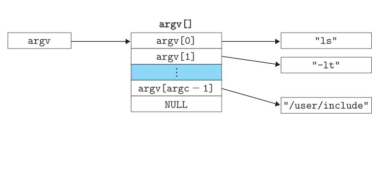
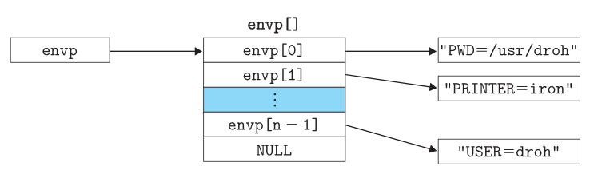

## 异常
异常是异常控制流的一种形式, 它一部分由硬件实现, 一部分由操作系统实现.   
事件: 处理器状态变化  
处理器通过一张异常表的跳转表, 进行间接过程调用, 到一个专门设计的操作系统子程序来处理异常.  
根据引起异常的事件类型, 会发生以下情况中的一种:
1. 处理程序将控制返回给当前指令, 即当事件发生时正在执行的指令
2. 处理程序将控制返回给下一条指令
3. 处理程序终止被中断的程序

#### 硬件异常和软件异常
C++, Java以catch, throw, try语句形式提供的是应用级ECF   

#### 异常处理
系统中可能的每种类型的异常都分配了一个唯一的非负整数的异常号:
1. 由处理器的设计者分配: 如被零除, 缺页, 内存访问违例, 断点, 算术运算溢出
2. 由操作系统内核的设计者分配: 系统调用, 来自外部I/O设备的信号

处理器通过执行间接过程调用处理异常, 通过异常表的表目K转到相应的处理程序   

异常表的起始地址放在异常表基址寄存器中, 异常号是异常表中的索引  

异常调用与过程调用的不同:
1. 根据异常的类型, 异常调用的返回地址要么是当前指令(事件发生时正在执行的指令), 要么是下一条指令(如果事件不发生, 将会在当前指令后执行的指令)
2. 处理器会把一些额外的处理器状态压到栈中, 在处理程序返回时, 重新开始执行中断的程序会需要这些状态
3. 如果控制从用户程序转移到内核, 所有这些项目都被压到内核栈中, 而不是压到用户栈中.
4. 异常处理程序运行在内核模式下, 这意味着它们对所有的系统资源都有完全的访问权限.  

## 异常的类型
#### 中断
中断是来自处理器外部的I/O设备的信号的结果, 不是由任何一条专门的指令造成的, 是异步发生的.   
在当前指令完成执行之后, 处理器注意到中断引脚的电压变高了, 就从系统总线读取异常号, 然后调用适当的中断处理程序.当处理程序返回时, 将控制返回给下一条指令.   
剩下的异常类型是同步发生的.

#### 陷阱和系统调用
陷阱是有意的异常, 是执行一条指令的结果. 陷阱处理程序将控制返回到下一条指令.   
陷阱最重要的用途是在用户程序和内核之间提供一个像过程一样的接口, 叫做系统调用.  
- *syscall*:处理提供的一条特殊的指令, 允许用户对内核服务的访问: 如读文件, 创建一个新的进程, 加载一个新的程序, 终止当前进程.执行syscall指令会导致一个到异常处理程序的陷阱.   

从程序员的角度看系统调用和函数调用时一样的, 然而他们的实现非常不同.普通函数运行在用户模式中, 系统调用运行在内核模式中.

#### 故障
故障由错误情况引起, 它可能被故障处理程序修正   
当故障发生时, 处理器将控制转移给故障处理程序, 如果处理程序能修正这个错误情况, 它将控制返回到引起故障的指令, 从而从新执行它, 否则, 处理程序返回到内核中的abort例程, abort例程会终止引起故障的引用程序.  
#### 终止
终止时不可恢复的致命错误造成的结果, 通常是一些硬件错误, 处理程序将控制返回给一个abort例程, 该例程会终止这个应用程序

####Linux/x86-64系统中的异常
x86-64系统定义了高达256中不同的异常类型.    
0-31对应Intel架构师定义的异常  
32-255对应的是操作系统定义的中断和陷阱   
##### 1.Linux/x86-64故障和终止
1. 除法错误(异常0): Unix会选择终止程序, Linux shell会把除法报告为"浮点异常(Floating exception)"
2. 一般性保护故障(异常13): 一个程序引用了一个为定义的虚拟内存区域, 或者试图写一个只读的文本段.Linux不会恢复这类故障, Linux shell通常会把这种一般保护故障报告为"段故障(Segmentation fault)"
3. 缺页(异常14): 处理程序将适当的磁盘上的虚拟内存的一个页面映射到物理内存的一个页面, 然后重新执行这条产生故障的指令
4. 机器检测: 在导致故障的指令执行中检测到致命的硬件错误时发生的.

##### 2.Linux/x86-64系统调用
Linux系统提供几百种系统调用, C程序用syscall函数可以直接调用任何系统调用.   
标准C库提供了一组方便的包装函数将参数打包在一起, 以适当的系统调用指令陷入内核, 然后将系统调用的返回状态传递回调用程序.     
所有到Linux系统调用的参数都是通过通用寄存器传递的.

## 进程
异常是允许操作系统内核提供进程概念的基本构造块, 进程是计算机科学中最深刻, 最成功的概念之一   

上下文: 上下文是有程序正确运行所需的状态组成, 这个状态包括存放在内存中的程序的代码和数据, 它的栈, 通用目的寄存器, 函数计数器, 环境变量以及打开文件描述符的集合.   

进程的经典定义是**一个执行中程序的实例**.系统中每个程序都运行在某个进程的上下文中.  

在shell中运行应用程序时, 应用程序运行在shell创建的新进程的上下文中, 应用程序也能够创建新进程.   

进程提供给应用程序的关键抽象:
1. 一个独立的逻辑控制流: 它提供一个假象, 好像我们的程序独占地使用处理器.
2. 一个私有的地址空间: 它提供一个假象, 好像我们的程序独占地使用内存系统

#### 逻辑控制流
逻辑控制流: 程序计数器(PC)值的序列(对应程序可执行目标文件中的指令, 或者是包含在运行时动态链接到程序的共享对象中的指令)   

每个进程独立执行它的流的一部分, 然后被抢占(preempted)(暂时挂起), 然后轮到其他进程.   

#### 并发流
并发(concurrency): 一个逻辑流的执行在时间上与另一个流重叠(流X开始在流Y开始之后, 结束之前), 多个流并发地执行的一般现象称为并发   

多任务: 一个进程和其他进程轮流运行的概念称为多任务   

时间片(time slice): 一个进程运行它的控制流的一部分的每个时间段叫时间片   

多任务也叫时间分片   

并行:  并行流是并发流的的一个真子集, 两个流并发地运行在不同的处理器核或者计算机上, 那么我们称它们为并行流(parallel flow),它们并行地运行(running in parallel), 且并行地执行(parallel execution)  

#### 私有地址空间
进程为每个程序提供一种假象, 好像它独占地使用系统的地址空间.   

一般而言, 和这个空间某个地址相关联的那个内存字节不能被其他进程读或者写, 从这个意义上说, 这个地址空间是私有的.

#### 用户模式和内核模式
处理器通常用某个控制寄存器中的一个模式位来提供用户模式和内存模式功能.   
- 内核模式: 当设置了模式位时, 进程就运行在内核模式中, 一个运行在内核模式的进程可以执行指令集中的任何指令, 并且可以访问系统中的任何内存位置.
- 用户模式: 没有设置模式位时, 进程就运行在用户模式中, 任何不合适的尝试都会导致致命的保护故障.用户程序必须通过系统调用接口间接地访问内核代码和数据.

进程从用户模式变为内核模式的唯一方法是通过诸如中断, 故障, 或者陷入系统调用这样的异常

#### 上下文切换
操作系统内核使用**上下文切换**的较高层形式的异常控制流来实现多任务.上下文切换建立在较底层异常处理机制上.   
内核为每个进程维持一个上下文   

内核可以决定抢占当前进程, 并重新开始一个先前被抢占的进程, 这种决策叫做调度, 是内核中称为调度器的代码处理的.   

上下文切换机制:
1. 保存当前进程的上下文
2. 恢复某个先前被抢占的进程被保存的上下文
3. 将控制传递给新恢复的进程


如果系统调用因为等待某个事件发生而阻塞, 那么内核可以让当前进程休眠, 切换到另一个进程.   

中断也可能引发上下文切换, 例如定时器中断.每次发生定时器中断时, 内核就能判定当前进程已经运行了足够长的时间,并切换到一个新的进程.

## 系统调用错误处理
当Unix系统级函数遇到错误时, 它们通常会返回-1, 并设置全局整数变量errno来表示什么出错了.  

错误处理包装函数:  对于一个给定的基本函数foo, 定义一个具有相同参数的包装函数Foo, 包装函数调用基本函数, 检查错误, 如果出错就终止.  

#### 获取进程ID

`pid_t getpid(void) // 当前进程ID`   
`pid_t getppid(void) // 父进程ID`

#### 创建和终止进程
从程序员角度看, 进程总是处于下面三种状态:
1. 运行: 要么在CPU上运行, 要么在等待被执行且最终被内核调度.
2. 停止: 进程的执行被挂起, 且不会被调度.当收到SIGSTOP, SIGTSTP, SIGTTIN, SIGOUT信号时, 进程就停止.并且保存停止知道它收到一个SIGCONT信号, 在这个时刻, 进程再次开始运行.
3. 终止: 进程永远停止.终止原因:
    1. 收到一个终止信号
    2. 从主程序返回
    3. 调用exit函数

父进程通过fork函数创建一个运行的子进程   

新创建的子进程得到与父进程用户级虚拟地址空间相同(但是独立)的一份副本, 包括代码和数据段, 堆, 共享库, 用户栈, 任何打开文件描述符相同的副本(标准输出).   

父进程与新创建的子进程之间最大的区别在与它们有不同的PID    

fork函数调用一次返回两次: 在父进程中返回子进程的PID, 在子进程中返回0   

父进程和子进程是并发运行的独立进程. 我们不能对不同进程中指令的交替执行做任何假设!!  

#### 回收子进程
当一个进程由于某种原因终止时, 进程被保持在一种已终止的状态中, 直到被它的父进程回收, 并不被内核立即清除.  

一个终止但还未被回收的进程称为僵死进程  

如果一个父进程终止了, 内核会安排init进程回收它的子进程.init进程的PID为1.    

init进程是系统启动时内核创建的, 它不会终止, 是所有进程的祖先.   

僵死进程没有运行, 但仍然消耗系统的内存资源   

一个进程可以通过调用waitpid函数来等待它的子进程终止或者停止.   

....


#### 让进程休眠
sleep将一个进程挂起一段指定的时间   

pause函数将调用函数休眠, 直到该进程受到一个信号.   

#### 加载并执行函数
execve函数在当前进程的上下文中加载并运行一个新程序, 调用一次从不返回.   

```
#include<unistd.h>
int execve(const char *filename, const char *argv[], const char *envp[]);
````

argv参数数据结构:  
  

envp参数数据结构:  
  

execve加载filename之后, 调用启动代码.启动代码设置栈, 并将控制传递给新程序的主函数. 主函数有如下形式的原型.    

`int main(int argc, char **argv, char **envp);`   

#### 程序与进程
程序与进程:   
- 程序: 可以作为目标文件存在于磁盘上, 或者作为段存在于地址空间中.   
- 进程: 执行中程序的一个具体的实例

fork与execve:   
- fork: 创建子进程, 在新的子进程中运行相同的程序, 新的子进程是父进程的一个复制品.
- execve: 在当前进程的上下文中加载并运行一个新的程序, 并没有创建一个新的进程.   

##### 简单shell
[my_shell.c](./my_shell.c)  

## 信号
一个信号就是一条小消息, 它通知进程系统中发生了一个某种类型的事件, 每种信号类型都对应于某种系统事件.   

传送一个信号到目的进程的步骤:
1. 发送信号: 内核通过更新目的进程上下文中的某个状态, 发送一个信号给目的进程. 发送信号的原因: 
    1. 内核检测到一个系统事件, 例如除0, 或者子进程终止.
    2. 一个进程调用了kill函数.显示要求内核发送一个信号给目的进程. 一个进程可以发送信号给它自己.
2. 接受信号: 当目的进程被内核强迫以某种方式对信号的发送做出反应时, 它就接受了信号. 进程可以忽略这个信号, 终止, 或者通过执行一个信号处理程序的用户层函数捕获这个信号. 

一个发出而没有被接受的信号叫做待处理信号, 在任何时刻一种类型至多只会有一个待处理信号. 

#### 发送信号
##### 进程组

每个进程都只属于一个进程组, 由一个正整数进程组ID来标识.getpgrp函数返回当前进程的进程组的ID.   

默认地, 一个子进程和它的父进程同属于一个进程组.可以通过使用setpgid函数来改变自己或者其他进程的进程组
```
#include<unistdh>
pid_t getpgrp(void);
/*
* 将进程pid的进程组改为pgid
* 如果pid是0, 就使用当前进程的PID
* 如果pgid是0, 就用pid指定的进程的PID作为进程组ID
* 例如: 进程2333 调用setpgid(0, 0);
* 会创建一个新的ID为2333的进程组, 并且把进程2333加入到进程组中.
*/
int setpgid(pid_t pid, pid_t pgid);
```

##### 用/bin/kill程序发送信号
/bin/kill程序可以向另外的进程发送任意的信号   
`linux> /bin/kill -9 2333`   
发送信号9给进程2333   

`linux> /bin/kill -9 -2333`  
发送信号9给进程组2333中的每个进程.

##### 从键盘发送信号
Unix shell 使用作业(job)这个抽象概念来表示对一条命令行求值而创建的进程, 在任意时刻, 至多有一个前台作业, 和0个或者多个后台作业, shell为每个作业创建一个独立的进程组.   

`linux> ls | sort`会创建一个由两个进程组成的前台作业, 两个进程通过Unix管道连接起来.一个进程运行ls程序, 一个进程运行sort程序.   

在键盘上键入Ctrl + C会导致内核发送一个SIGINT信号到前台进程组的每个进程.默认情况下, 终止前台作业.   

在键盘上键入Ctrl + Z会导致内核发送一个SIGTSP信号到前台进程组的每个进程.默认情况下, 停止(挂起)前台作业.

##### 用kill函数发送信号
进程通过调用kill函数发送信号给其他进程(包他们自己)   

```
#include<sys/types.h>
#include<signal.h>

/*
* pid > 0, 发送信号给进程pid
* pid = 0, 发送信号给调用进程所在的进程组中的所有进程(包括自己)
* pid < 0, 发送信号给进程组|pid|中的每个进程.
*/
int kill(pid_t pid, int sig);
```

##### 用alarm函数发送信号
```
#include<unistd.h>
// 安排内核在secs秒后发送一个SIGALAM信号给调用进程
unsigned int alarm(unsigned int secs);
```

#### 接受信号
当内核把进程P从内核模式切换到用户模式时(例如, 系统调用返回, 完成一次上下文切换), 它会检测进程p的未被阻塞的待处理信号集合: 
1. 集合为空(通常情况): 内核把控制传递给p的逻辑控制流中的下一条指令.
2. 集合非空: 内核选择集合中的某个信号k(通常是最小的k), 强制p接受信号k, p会采取某种行为, 完成某种行为后, 控制传递回p的逻辑控制流的下一条指令.每个信号类型都有下面其中一种的默认行为:
    - 进程终止
    - 进程终止并转储内存
    - 进程停止(挂起)知道SIGCONT信号重启.
    - 进程忽略该信号

进程可以通过使用singal函数修改和信号相关联的默认行为(SIGSTOP 和 SIGKILL不能修改)   

```
#include<signal.h>

typedef void(*sighhandler_t)(int);
/*
* 如果handler是SIG_IGN, 则忽略signum信号
* 如果handler是SIG_DFL, 则signum信号恢复默认行为
* 如果handler是用户定义的函数地址, 这个函数称为信号处理程序.当信号处理程序返回时, 控制传递回控制流中中断处的指令.
*/
signhandler_t signal(int signum, sighandler_t handler);
```   
[捕获信号](./catch_signal.c)


