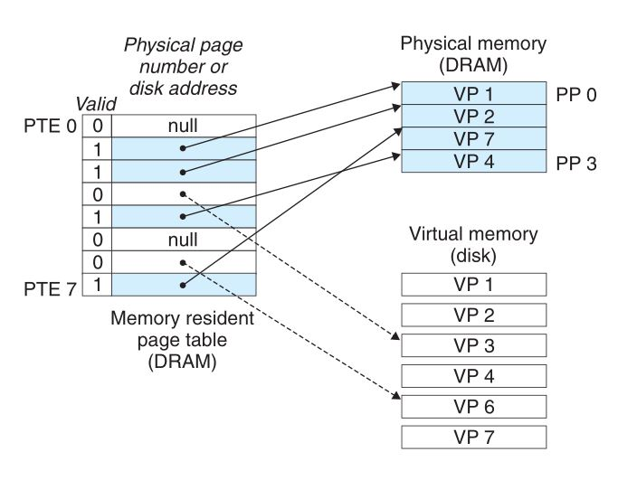
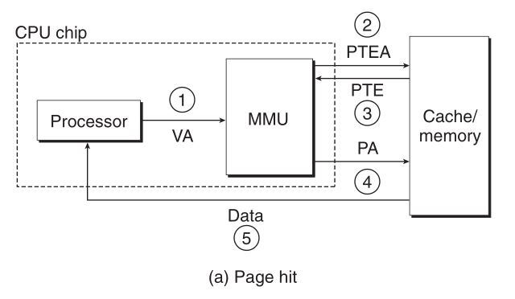
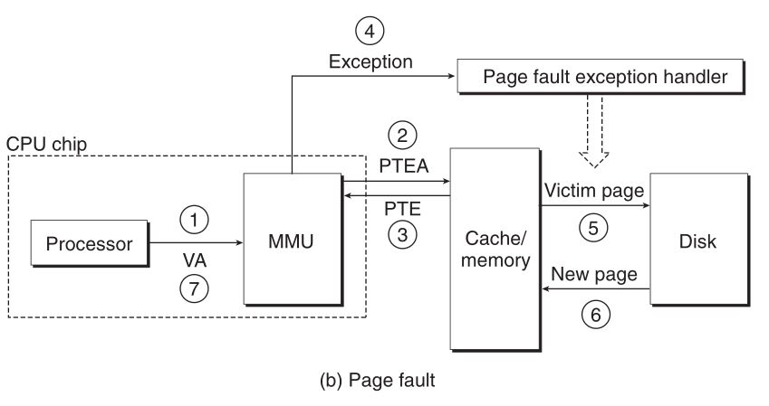
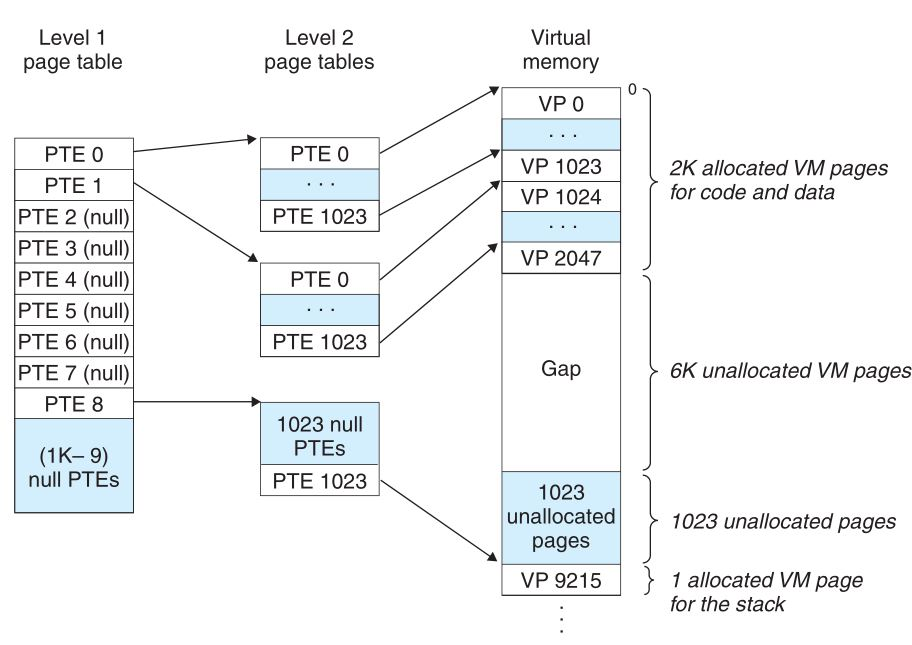
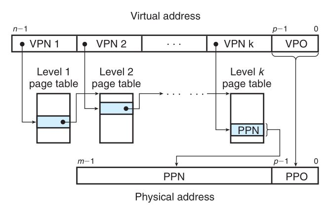

# 虚拟内存

## 物理和虚拟寻址
早起的PC使用物理寻址, 现代处理器使用虚拟寻址.虚拟地址在被送到内存之前先转换成适当的物理地址.  

## 地址空间
地址空间: 是一个非负整数地址的有序集合, 如果地址空间中的整数是连续的, 它就是一个线性地址空间.   

虚拟地址空间: CPU从一个由N=个地址的地址空间生成虚拟地址, 这个地址空间称为虚拟地址空间.虚拟地址空间的位数为n.   

物理地址空间: 对应于系统中物理内存的M个字节   

主存中的每个字节都有一个选自虚拟地址空间的虚拟地址和一个选自物理空间的物理地址.   

#### 虚拟内存作为缓存的工具
虚拟内存: 一个由存放在磁盘上的N个连续的字节大小的单元组成的数组. 每个字节都有一个唯一的虚拟地址, 作为到数组的索引.磁盘上的数组内容被缓存在主存中.  

虚拟页: 磁盘上被VM系统分割的块, 作为磁盘和主存之间的传输单元.   

物理页: 物理内存被分割成的块, 大小与虚拟页相同. 也称为页帧. 

任何时刻, 虚拟页面的集合都分为三个不相交的集合: 
1. 未分配的: VM系统还未分配(或者创建)的页. 未分配的块没有任何数据和它们关联, 因此不占任何磁盘空间.
2. 缓存的: 当前已缓存在物理内存中的已分配页.
3. 未缓存的: 未缓存在物理内存中的已分配页.

#### DRAM缓存的组织结构
DRAM缓存中的不命中比SRAM缓存中的不命中的花费的代价要昂贵得多.  

#### 页表
页表: 存放在物理内存中的数据结构, 将虚拟页映射到物理页. 页表就是一个页表条目的数组.虚拟地址空间中的每个页在页表中一个固定偏移量出都有一个页表条目(PTE)   

   

#### 页命中
CPU读取虚拟内存中的一个字时, 地址翻译硬件将虚拟地址作为一个索引来定位对应的页表条目. 如果条目中的有效位为1, 说明已缓存在内存中. 然后使用条目中的物理内存地址构造出这个字的物理地址.

#### 缺页
DRAM缓存不命中称为缺页   

当虚拟内存对应的页表条目中有效位为0, 推断出当前虚拟页未缓存在内存中. 这时触发一个缺页异常. 缺页异常调用内核中的缺页异常处理程序. 缺页异常处理程序选择一个牺牲页, 如果牺牲页已经被修改, 内核将它复制会磁盘, 更新页表.然后重启导致缺页异常的指令.

#### 局部性
尽管整个运行过程中程序引用的不同页面的总是可能超过物理内存总数, 但局部性保证了再任意时刻, 程序将趋向于在一个较小的活动页面集合(工作集, 常驻集合)上工作.   

抖动: 工作集的大小超出了物理内存, 页面将不断地换进换出

## 虚拟内存作为内存管理工具
操作系统为每个进程提供了一个独立的页表, 因而独有独立的虚拟地址空间. 多个虚拟页面可以映射到同一个共享的物理页面上.   

虚拟内存作用:
- 简化链接: 独立的地址空间允许每个进程的内存映像使用相同的格式, 不管代码和数据实际存放在物理内存的何处.

- 简化加载: 加载器加载目标文件到一个新创建的进程中时, 加载器为代码和数据分配虚拟页, 他它们标记为未缓存的, 将页表条目指向目标文件中适当的位置. 加载从不从磁盘到内实际复制任何数据. 每个页初次被引用(CPU取指令或者正在执行的指令引用一个内存位置)时, 虚拟内存系统按需自动调入数据页
- 简化共享: 操作系统将不同进程中适当的虚拟页面映射到相同的物理页面, 从而安排多个进程共享这部分代码的一副本, 而不是在每个进程中都包含单独内核和C标准库的副本.
- 简化内存分配: 用户进程要求额外的堆空间时, 操作系统分配一个适当数字K个连续的虚拟内存页面, 并且将他们映射到物理内存中任意位置的K个任意物理页面(没有必要连续).

## 虚拟内存作为内存保护的工具
PTE上添加额外的许可位来控制一个虚拟页面访问权限.

## 地址翻译
地址翻译是一个N元素的虚拟地址空间中的元素和一个M元素的物理地址空间中元素之间的映射   

CPU中的一个控制寄存器, 页表基址寄存器指向当前页表.   
n为虚拟地址包括两个部分:
1. 一个p位的虚拟页面偏移(VPO)
2. 一个n-p位的虚拟页号(VPN)

页面命中步骤:  
  

页面缺失步骤:  
  

#### 结合高速缓存和虚拟内存
地址翻译发生在高速缓存查找之前, 页表条目可以缓存.  

#### 利用TLB加速地址翻译
在MMU中包括了一个关于PTE的小缓存, 称为翻译后备缓冲器(TLB)

#### 多级页表
用来压缩页表的常用方法是使用层次结构的页表   

>例如: 一级页表中每个PTE负责映射虚拟地址空间中一个4MB的片, 每片都由1024个连续的页面组成.   
如果片i中每个页面都未分配, 那么一级PTEi就为空.   
如果片i中至少有一页是分配了的, 那么一级PTEi就指向一个二级页表的基址.  

   

这种方法从两个方面减少了内存要求: 
1. 如果一级页表中的一个PTE是空的, 那么对应的二级页表根本不会存在.这代表着巨大的潜在节约.
2. 只有一级页表才需要总是在主存中, 虚拟内存系统可以在需要时创建, 页面调入或调出二级页表.减少了主存的压力, 只有最常用的二级页表才需要缓存在主存中.

k级页表层次结构的地址翻译:  

  

TLB会在访问k个PTE中起作用.  

